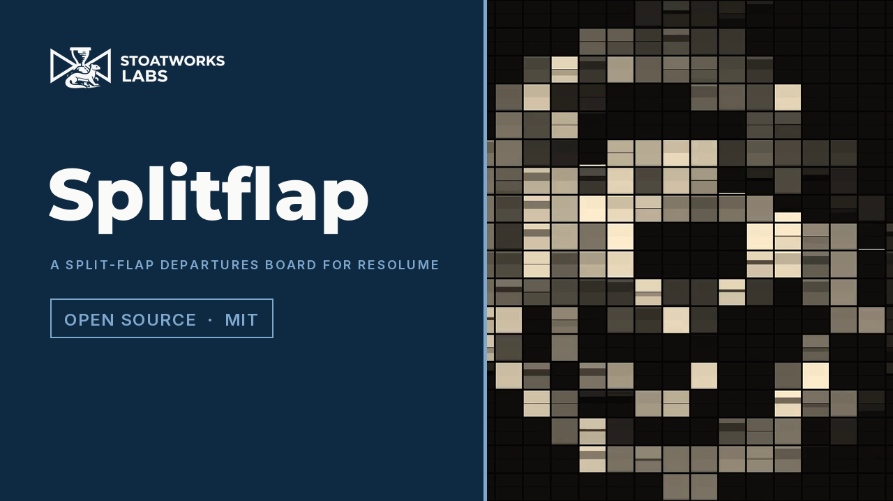
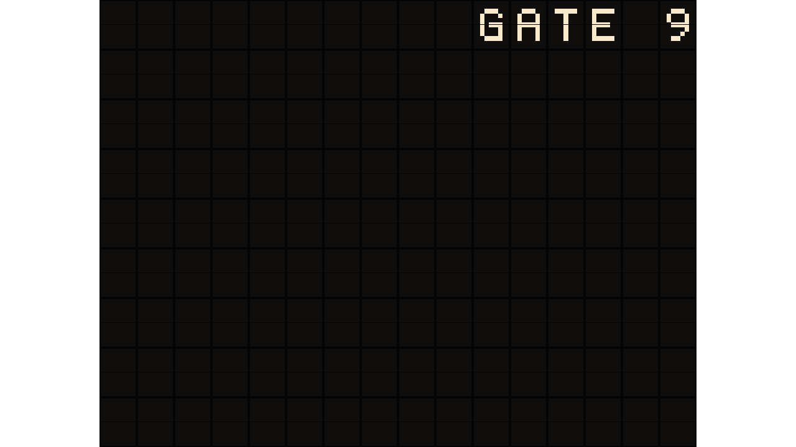
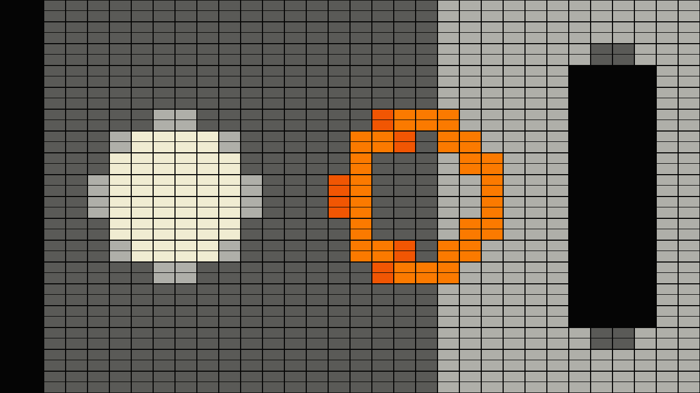

# splitflap

> **AI-assisted project.** This codebase was created with [Claude](https://claude.com/claude-code)
> (Anthropic), directed and reviewed by a human author. Every claim below is
> *measured* off the rendered picture by an offline harness that drives the
> real plugin class in a headless GL context, at 640×360 and at 320×180: between
> two targets every cell of a 32-cell board makes **exactly (t − c) mod N
> flips**, counted as tone changes on its top row (`sftest --flips`); one step
> brighter settles in **one flip time** and one step darker in **N − 1**
> (`--asymmetry`); the flap in the air follows the rigid-body fall to within
> **0.5 px** of a 90 px half-cell and lands on the stated frame (`--fall`), against
> a solution the harness integrates itself; a resize and a regrid mid-flip
> keep every flap (`--resize`); loud audio on frame one fires nothing
> (`--prime`). Each check ships with a negative control that must fail, and all
> six do. Every one of the 23 controls is proven to change the picture at both
> rasters, and the bundle registers, instantiates and lights pixels under the
> fleet's oxbow host. **It has never been loaded into Resolume.**

The picture on a split-flap departures board. An FFGL **effect** for Resolume
Arena and Avenue.

The harness's test card, a third of the way through a change. Rendered by
the plugin's offline harness (`sftest`), not captured from Resolume.

## The one idea

A split-flap unit holds a drum of N flaps, each printed with one symbol, and
**it can only turn forward, one flap at a time, at the motor's rate.** To show a
new symbol it passes through every flap between the one on show and the
target. Give every cell of a board a drum — greys, colours or characters —
point the board at the clip, and the look of a departures board changing falls
out of that one constraint. Nothing is animated by hand.

### What falls out

- **A change ripples.** Each cell needs (target − current) mod N flips, so
  cells arrive at different times and a big change sweeps across the board as
  a clatter.
- **Asymmetry.** With the drum printed dark to light, brightening by one step
  is one flip and darkening by one step is N − 1 flips. A fade-up snaps; a
  fade-down churns through the whole drum.
- **A moving picture is never finished.** When the clip changes faster than
  the cells can flip, the board chases it and every cell mid-flip shows the
  drum's intermediate flaps.
- **The flap is a hinged plate.** The top half falls under gravity about the
  split line — an inverted pendulum let go, which hesitates and then slaps —
  lands on the stop with a bounce, and its shading follows its angle. That is
  the flicker you see on a real board, and it is solved from θ″ = (3g/2L) sin θ
  once, in double, on the CPU.

*[Watch it](https://www.youtube.com/watch?v=72hGrIignmk) — 62 seconds: the
board flipping up to the picture and chasing the clip, the tails a moving
shape drags when darkening is the whole drum, Flip Time slow and fast, the
fall on eight big cells at a second a flap, three palettes, a departures
listing on the Text drum latched and then scrambled, and Interval updates with
Stagger and Module Width. Rendered through `sftest --pipe`, silent.*

The Text drum: the message is the target where the clip is bright, the
blank flap where it is not. Every letter is a run of flips from the blank; a cell lights at a quarter of full luma.

## Controls

- **Board** — Columns (4–96), Rows (2–54), Fit (stretch the cells to fill the
  frame; off, Cell Aspect is honoured and the board is centred with a
  transparent surround), Cell Aspect, Gap, Split Line.
- **Drum** — Drum (Tones / Colours / Text), Flaps (N, 2–64, for Tones and
  Colours; the Text drum is a fixed 45-character alphabet), Drum Order (Dark to
  Light / Light to Dark / Shuffled — the order is the asymmetry), Palette (six,
  for Colours), Text (the message, wrapping at Columns).
- **Motor** — Flip Time (30 ms to 1 s a flap), Stagger (up to a second of
  per-cell start delay, by a hash of the cell), Module Width (cells in a row
  that share one drive and so start together), Update (Continuous / Interval /
  Onset / Manual), Interval, Update Now, Audio (the host's spectrum, for Onset).
- **Look** — Flap Colour (the lightest tone; the plates are 6 % of it), Light
  Angle (±60° elevation, Lambert on every flap), Bounce (restitution at the
  stop, 0 lands dead), Mix.

Defaults: a 32×18 board of square cells filling the frame, twelve warm-white
tones from dark to light, 80 ms a flap with 150 ms of stagger, chasing the
clip continuously.

## Status

**v0.1.0, released 2026-09-24, and honestly early.**

Verified, by measurement on this machine (Apple Silicon, macOS 26.4), with
`tools/verify.sh` green:

- **The flips.** On an 8×4 board with an 8-flap drum, from one picture of
  distinct tones to another, every cell's top row changed tone exactly
  (t − c) mod 8 times over 94 frames and both halves settled on the target, at
  640×360 and 320×180 (32 of 32 cells each). With backward flips allowed, 8 of
  32 fail.
- **The asymmetry.** A 12-frame flip time: one step brighter is bit-identical
  from frame 11 after the change (the first flap lands on frame 12·1 − 1), one
  step darker from frame 83 (12·7 − 1). Backward, the darken settles on frame
  12.
- **The settle.** A 16×9 board of tones near but not on the flaps, 0.3 s of
  stagger, the default bounce: every cell on its nearest flap by frame 127
  (7 flips + stagger + the 0.38 s flutter), then bit-identical for 30 frames.
- **The fall.** A one-second flip on 90 px and 45 px half-cells: the drawn flap
  within **0.49 px** of L|cos θ(t)| on all 59 frames, against the harness's own
  velocity-Verlet solution of the same physics, and it lands on frame 59. The
  flutter after landing at full bounce (72° on the first rebound) within
  0.48 px over 40 frames. A constant angular acceleration fails on 6 of 6
  assertions; gravity 15 % high lands on frame 55 and fails on 6 of 6.
- **The state survives.** A 640×360 → 320×180 resize (and back) on frame 30 of a
  run, and 8 → 16 columns on frame 30: every cell, and every child cell, kept
  its flap and finished its count. With the state cleared on a resize, 28 of
  32 fail.
- **Frame one.** In Onset mode, all 64 bins at 0.5 from the first frame: no
  onset and no flip in 60 frames; a step to 1.0 fires on its frame and the
  board reaches its target. Unprimed, the detector fires on frame 0 and is
  then deaf to the real onset.
- **No dead controls.** All 23 change the picture at 640×360 and 320×180.
- **The pipe.** Three 64×36 frames are 27,648 bytes; a reader that hangs up
  gets exit status 1, not SIGPIPE's 141.
- **Cost**, `sftest --bench` (60 frames after a 20-frame warm-up, glFinish both
  sides, the largest board the controls allow, 96×54, the universal build):
  **1.16 ms at 1280×720, 1.60 ms at 1920×1080, 4.21 ms at 3840×2160** — a
  quarter of a 60 fps frame at 4K on the biggest board. Measured on a machine
  running seven other builds: the same binary read 6.0, 7.4 and 11.6 ms with
  the load average at 13 and 1.99, 3.01 and 5.53 ms during `verify.sh`, so
  the numbers above are the quietest of four runs, not a promise. The board
  pass is one state fetch and a few branches per pixel; it is not free.
- The bundle is universal (`lipo`: x86_64 arm64), exports `plugMain`, ad-hoc
  signs, and probes under oxbow as **SW Splitflap / SF01 / effect**.
- **Windows, in Resolume Arena 7.27.1** (win-lab, Mesa llvmpipe, no GPU, 2026-09-24): the v0.1.0 candidate DLL loads from Extra Effects, registers as `SW Splitflap` / `SF01` / effect, all 30 host controls match the declaration in name, order, type, range and default, it renders and Arena's log stays clean: 9 of the fleet gate's 9 checks, with 15 controls moving the picture (Cell Aspect under Fit off, Palette under the Colours drum). Seven controls read inert on the gate's still carrier by design: Flip Time, Stagger, Module Width, Update, Interval, Bounce and Drum Order act only while cells are moving or settle to the same tone, and the harness measures each of them; Audio was skipped for want of a sound device. Software rendering says nothing about a GPU or about speed.

Not verified, and not pretended:

- **Never loaded into Resolume on macOS.** Everything above is the
  offline harness driving the real plugin class in a headless GL context. How
  23 controls in four groups present in the inspector, and whether a Text
  parameter on an effect edits comfortably there, is untested.
- **No real audio has reached it in a host.** The onset detector sums root
  magnitude over all 64 bins and asks only whether more of them just got
  louder, so it assumes nothing about the bins' layout; its thresholds were
  set on synthetic spectra, not on programme material through Resolume's FFT.
- **The harness has run on this Mac's GPU only.** CI is written but has not
  run.
- No factory presets and no OpenFX port. There is a [user guide](https://stoatworks-labs.com/software/splitflap/guide/)
  and a browser demo at [splitflap-demo.stoatworks-labs.com](https://splitflap-demo.stoatworks-labs.com)
  (a port of the shaders and the CPU half to a web page, not the plugin).
- **The Text drum lights a cell at a quarter of full luma**, lowered from a half before the
  tag: the release survey measured every bundled demo clip's cell means at the latch frame,
  and at 0.5 none lit more than 18 of 120 cells. Rainbow and Candy have no dark stop, so a
  dark cell takes their first swatch; the guide says which palettes to use on a dark clip.

## Installing

Build (below) and `cmake --install build`, which puts `Splitflap.bundle` into
`~/Documents/Resolume Arena/Extra Effects`; for Avenue pass
`--prefix "$HOME/Documents/Resolume Avenue/Extra Effects"`. On macOS nothing in
this repo has run inside Resolume; on Windows the release DLL has (below).

## Building

C++17 + GLSL 4.10, CMake, FFGL 2.1 (SDK vendored as a submodule pinned to
`b1afaf9`). macOS builds are universal (arm64 + x86_64); Windows needs GLEW
via vcpkg.

    git clone --recursive https://github.com/stoatworks-labs/splitflap
    cmake -B build -DCMAKE_BUILD_TYPE=Release
    cmake --build build

## Building and testing

The offline harness renders the real plugin class headlessly and reads the
picture back:

    ./build/sftest --out /tmp/frame.png              # the test card, 120 frames in
    ./build/sftest --out /tmp/f.png --drift 2        # with the card on the move
    ./build/sftest --flips                           # (t - c) mod N, off the picture
    ./build/sftest --asymmetry                       # one flip up, N - 1 down
    ./build/sftest --settle                          # nearest flap, then bit-identical
    ./build/sftest --fall                            # the plate against the physics
    ./build/sftest --resize                          # the state across a resize and a regrid
    ./build/sftest --prime                           # frame one fires nothing
    ./build/sftest --negative                        # every broken model must fail
    ./build/sftest --bench                           # 720p, 1080p, 4K on a 96 x 54 board
    python3 tools/sweep.py                           # no control is silently dead
    tools/verify.sh                                  # all of it (bash)

Frames for video, the fleet's format:

    ffmpeg -i in.mov -f rawvideo -pix_fmt rgba - \
      | ./build/sftest --pipe --size 1920x1080 --fps 60 --script cues.txt \
      | ffmpeg -f rawvideo -pix_fmt rgba -s 1920x1080 -r 60 -i - out.mov

`tools/clips.sh` runs a few of Resolume's bundled demo clips through the
defaults and writes a still of each.

## Diagnostics

`source/Diag.{h,cpp}` — log file only, no crash handler (this runs inside
Resolume). It records the GL driver, which shader failed if one did, the host
clock's unit, and whether audio ever reached the layer.

    ~/Library/Logs/splitflap/splitflap.YYYY-MM-DD.log

<!-- attributions:start -->
This project is built on other people's work — see [ATTRIBUTIONS.md](ATTRIBUTIONS.md).
<!-- attributions:end -->

## Licence

MIT.

The mechanism is the split-flap display's own — a drum that turns one way —
and the flap's fall is the textbook rigid plate about an edge. No board's
typeface, artwork or sound was used: the font is graticule's, the palettes are
authored here, and there is no clatter because FFGL has no audio output.

## The browser demo

[splitflap-demo.stoatworks-labs.com](https://splitflap-demo.stoatworks-labs.com)
runs the plugin's own shaders in WebGL2 on generated clips — the motor that
holds every cell's state in a float texel included — with the fall table, the
drum print, the font, the onset detector and the update decision ported to
JavaScript by hand. It is a port to a web page rather than the plugin: no audio
reaches it (Onset mode never fires), Update Now is a button, the integer
controls are dropdowns, and it says all of this on the page.
`demo/tools/check_shaders.py` holds the page's copy of every shader and of the
font to the C++, and `tools/verify.sh` runs it.
