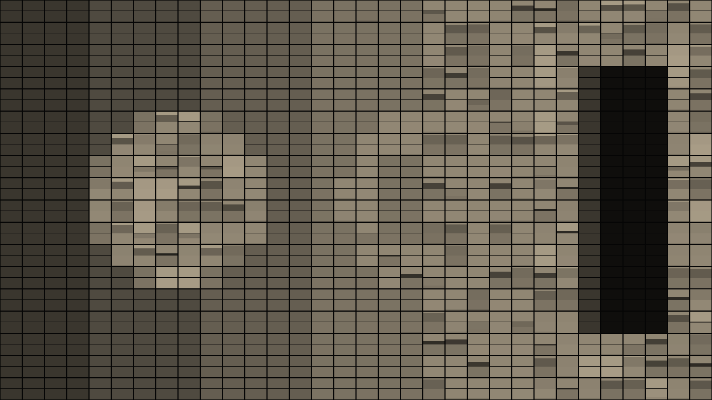

# Splitflap user guide

Splitflap is **the picture on a split-flap departures board, for
[Resolume](https://resolume.com) Arena and Avenue**, as an FFGL effect. It does not paint a grid
of tiles that fade to the clip. Every cell of the board is a drum of flaps, each printed with one
symbol, and **a drum can only turn forward, one flap at a time, at the motor's rate**. To show a
new symbol a cell passes through every flap between the one on show and the target, and every flap
in the air is a hinged plate falling under gravity, which hesitates, slaps on to the stop and
flutters. Point that board at the clip and the look of a departures board changing falls out of
the one constraint: a change ripples, a step brighter is one flip and a step darker is the whole
drum, and a moving picture is never finished. Nothing is animated by hand.



*The repo's test card through the plugin at its defaults, a third of the way through a change,
rendered by the offline harness rather than captured from Resolume: a 32 × 18 board of twelve
warm-white tones, 80 ms a flap, the cells still on their way to the target showing the drum's
intermediate flaps.*

> **Before you rely on this:** released at **v0.1.0**, and honestly early. The board is measured
> rather than asserted, by a harness that drives the real plugin class and reads each claim off the
> picture it rendered, at 640 × 360 and at 320 × 180: between two targets every cell of a 32-cell
> board makes exactly (target − current) mod N flips, counted as tone changes on its top row; one
> step brighter settles in one flip time and one step darker in N − 1; a still input lands on the
> nearest flap within the stated bound and then holds bit-identical; the flap in the air follows a
> rigid-body solution the harness integrates itself, within half a pixel of a 90-pixel half-cell,
> and lands on the stated frame; a resize and a regrid mid-flip keep every flap; loud audio on
> frame one fires nothing. Six deliberate faults are shown to make those checks fail, and one
> character changed in the shipped shader is caught. All 23 controls are shown to change the
> picture. It has **never been loaded into Resolume on macOS** — the one host it has run in is the
> fleet's own test host, `oxbow`.
> Try it on a spare layer before you put it in a show.
>
> This codebase was created with AI assistance, directed and reviewed by a human author.

---

## Installing

Every download carries one effect, **SW Splitflap**. Drop it into Resolume's effects folder and
restart Resolume:

```
macOS    ~/Documents/Resolume Arena/Extra Effects/
Windows  %USERPROFILE%\Documents\Resolume Arena\Extra Effects\
```

Avenue uses the same layout under its own folder name. The effect then appears in the effects
browser as **SW Splitflap**.

The macOS download is a universal build (Apple silicon and Intel), as a `.dmg` or a `.zip`. It is
**Developer ID-signed and notarised**, so the bundle simply loads. The Windows download is an x64
installer or a `.zip`. It is not code-signed, so the installer trips SmartScreen once: **More
info** → **Run anyway**.

---

## A drum that only turns forward

A split-flap unit is a drum of N flaps on a shaft, each flap printed with one symbol, driven by a
motor that turns one way. The flap on show is held by a stop; the motor lifts the next flap over
the top, it falls under its own weight on to the stop, and the symbol changes. To show a symbol
three flaps away the drum makes three flips, and to show the symbol one flap *behind* the one on
show it goes the whole way round. That is the whole mechanism, and everything Splitflap does
follows from it:

- **Each cell reads the clip and picks a target flap.** The cell's mean colour is taken from the
  clip and matched to the nearest flap on its drum: the nearest grey for a drum of tones, the
  nearest swatch for a palette, or its character of the message where the clip is bright.
- **The motor takes the cell there, one flap per Flip Time.** Never backwards, never two at once.
  A cell whose target is far round the drum takes longer, so a change in the picture arrives as a
  ripple rather than a cut.
- **The order the flaps are printed in is the asymmetry.** With the drum printed dark to light, a
  step brighter is one flip and a step darker is N − 1. A fade-up snaps; a fade-down churns
  through every tone. Print it the other way and the asymmetry reverses; shuffle it and every
  change is a scramble.
- **The clip does not wait.** If the clip changes faster than the cells can flip, the board
  chases it and every cell mid-flip shows the flaps between where it was and where it is going.
  A busy clip on a slow drum is a board that never finishes.
- **The flap in the air is a real fall.** It is let go three degrees past vertical, so it hesitates
  at the top, whips through the horizontal and slaps on to the stop, where it rebounds and settles.
  The fall is solved once from θ″ = (3g/2L) sin θ, in double on the CPU, and Flip Time scales
  gravity so one fall takes one flip time. The plate's shading follows its angle, which is the
  flicker a real board has.

Nothing is drawn as an animation. The motor is a state machine per cell — the flap on show, the
fall phase of the flap in the air, the latched target and a timer — held in one float texel, and
the board is drawn from that state every frame.

---

## Start here

Put SW Splitflap on a clip or a layer with footage that has some contrast and moves. The defaults
are a 32 × 18 board of twelve warm-white tones, 80 ms a flap with 150 ms of stagger, chasing the
clip continuously: out of the box the picture reads through the board and every movement in the
clip becomes a clatter of cells. Then:

1. **Flip Time → about 0.6** (0.25 s a flap). The board can no longer keep up with the clip; every
   cell is mid-flip most of the time and the picture is a churn of intermediate tones. Bring it
   back to the default and the picture settles as the board catches up.
2. **Drum Order → Light to Dark.** The same clip, but now it is the fade-*ups* that churn through
   the drum and the fade-downs that snap. **Shuffled** makes every change a scramble.
3. **Update → Manual**, then press **Update Now** with the clip running. The board latches the
   frame under it and flips to it while the clip goes on; press again and it chases the new
   frame. **Update → Interval** does that on a clock, every Interval seconds.
4. **Drum → Colours**, **Palette → Airport.** Black, cream, yellow, orange and red flaps: the
   nearest swatch for each cell. Try Rainbow on a saturated clip and Ocean or Ember on a dark one.
5. **Drum → Text**, and type a message in **Text**. The board shows the message where the clip is
   bright and the blank flap where it is not, one character a cell, wrapping at Columns. Every
   letter is a run of flips from the blank, so a shape sweeping across the clip spells the message
   as it goes. A 16 × 9 board is a good size for it.
6. **Bounce → 1**, and **Flip Time** up so you can see it: the flap rebounds to 72° off the stop
   on its first bounce and flutters down. **Light Angle** moves the light through ±60° of
   elevation; at 0.5 it is straight on and the plates at rest are brightest.

Every slider is declared to the host as 0 to 1, so the host only knows its position. The value
each position stands for is given with each control below.

---

## The Board group

**Columns** — cells across, **4 to 96**; **32** by default. An integer.

**Rows** — cells down, **2 to 54**; **18** by default. An integer. The largest board is 96 × 54,
5,184 cells.

**Fit** — on by default. On, the cells stretch to fill the frame whatever their count, so the
board always covers the layer. Off, every cell has the shape Cell Aspect asks for, the board is
centred, and the surround is **transparent** so the layers below show through.

**Cell Aspect** — width over height of one cell, **0.5 to 1.5**, linear; **0.75 at the default of
0.25**, a cell three-quarters as wide as it is tall, the shape of a printed flap. Only read with
Fit off.

**Gap** — the frame between cells as a fraction of the cell's width, **0 to 25 %**; **6 % at the
default of 0.24**. The frame is near-black, whatever the flap colour.

**Split Line** — the line across the middle of every cell where the flap hinges, as a fraction of
the cell's height, **0 to 12 %**; **3 % at the default of 0.25**. At 0 the halves touch.

---

## The Drum group

**Drum** — what the flaps are printed with: **Tones**, **Colours** or **Text**; Tones by default.

- *Tones*: N greys from 6 % of the flap colour to the flap colour itself, evenly spaced. A cell's
  target is the flap whose tone is nearest its mean luma.
- *Colours*: N swatches sampled along the chosen Palette. A cell's target is the swatch nearest its
  mean colour.
- *Text*: a fixed drum of 45 characters — the blank first, then `A`–`Z`, `0`–`9` and `- . : ! ? /
  ' &` — and the message in **Text** laid across the board one character a cell, wrapping at
  Columns. A cell's target is its character where the cell's mean luma is at least 0.5 and the
  blank where it is not. Flaps is ignored.

**Flaps** — N, the flaps on each drum, **2 to 64**; **12** by default. An integer. Fewer flaps is a
coarser picture and a shorter way round; more is a smoother picture and a longer churn for a
step the wrong way. Tones and Colours only.

**Drum Order** — how the flaps are printed round the drum: **Dark to Light**, **Light to Dark** or
**Shuffled**; Dark to Light by default. This is the asymmetry: Dark to Light makes brightening
cheap and darkening dear, Light to Dark the reverse, and Shuffled (a fixed permutation) makes
every step a scramble through unrelated flaps. On the Text drum the blank stays at flap 0 in every
order, so a cell always clears to blank the same way.

**Palette** — for the Colours drum: **Amber** (black, amber, straw), **Airport** (black, cream,
yellow, orange, red), **Rainbow**, **Ocean** (navy, blue, cyan, white), **Ember** (black, deep red,
orange, gold) or **Candy** (pink, yellow, mint, blue, purple); Amber by default. The N flaps are
sampled evenly along the palette's stops. A cell's target is the swatch nearest its mean colour,
and **Rainbow and Candy have no dark stop**: every swatch is equally far from black, so a dark
cell lands on the first one (red on Rainbow, pink on Candy) and a dark clip floods with it. Use
Amber, Airport, Ocean or Ember on a dark clip, or lift the clip first.

**Text** — the message for the Text drum; `DEPARTURES` by default. Upper case, digits and the
punctuation on the drum; anything else prints as the blank. It wraps at Columns, one character a
cell, from the top-left.

---

## The Motor group

**Flip Time** — seconds for one flap to fall, **30 ms to 1 s** on a logarithmic slider; **80 ms at
the default of 0.28**. The motor's rate: a cell advances one flap per Flip Time, and the fall of
the flap in the air is scaled to take exactly that long. At 80 ms a twelve-flap drum goes round
in about a second.

| Slider | one flap | a 12-flap drum, all the way round |
| --- | --- | --- |
| 0 | 30 ms | 0.36 s |
| 0.28 | 80 ms | 0.96 s |
| 0.5 | 0.17 s | 2.1 s |
| 0.75 | 0.42 s | 5.0 s |
| 1 | 1 s | 12 s |

**Stagger** — a start delay per cell, **0 to 1 s**, linear; **150 ms at the default of 0.15**.
When a new target arrives a cell waits up to this long, decided by a hash of its module, before
its first flip, so a change does not start everywhere on the same frame. A cell that is already
flipping does not wait. At 0 every cell starts at once.

**Module Width** — cells in a row that share one drive, **1 to 16**; **1** by default. An
integer. Cells in a module take the same stagger, so a row of them starts together, the way a
row of units on one shaft would; cells whose targets differ still land at different times.

**Update** — when the board reads the clip and sets new targets: **Continuous**, **Interval**,
**Onset** or **Manual**; Continuous by default.

- *Continuous*: every frame. The board chases the clip.
- *Interval*: every **Interval** seconds, from the moment the mode was chosen. A stall longer than
  the interval gives one update, not a burst.
- *Onset*: on an onset in the **Audio** input. One detector over all 64 bins: the total rise in
  root magnitude since the last frame, against a floor that follows it over a second, firing on a
  rising frame that clears 2.5 × the floor, with a 100 ms refractory. The detector is **primed on
  the first frame** — the floor is seeded from the level that is already there — so triggering a
  clip on a loud passage does not fire it.
- *Manual*: only when **Update Now** is pressed.

In every mode the board latches whatever is under it on its first frame, so it is never blank
while it waits for an update.

**Interval** — seconds between updates in Interval mode, **0.1 to 10 s** on a logarithmic slider;
**2 s at the default of 0.65**.

**Update Now** — the button. One press latches the clip as the new target in any mode.

**Audio** — Resolume's audio source picker, an FFT buffer of 64 bins, for Onset mode. With
nothing routed the detector hears silence and never fires.

---

## The Look group

**Flap Colour** — the lightest tone on a Tones drum, and the colour the message is printed in on
the Text drum; **warm white (1.00, 0.93, 0.80)** by default. The darkest tone, the plates, the
blank flap and the cell frame are derived from it: the plates are 6 % of it. Colours drums take
their colours from the palette.

**Light Angle** — the light's elevation, **−60° to +60°**, linear; **+12° at the default of
0.6**, a little from above. 0.5 is straight on, where the plates at rest are brightest. Every
plate is lit Lambert with 30 % ambient: the plate at rest by the cosine of the elevation, the
front of a falling flap by cos(θ + elevation) and its back by −cos(θ + elevation), so a flap
changes brightness as it turns. A light from above makes the falling flap's back catch the
light as it comes down; from below, its front.

**Bounce** — the coefficient of restitution at the stop, **0 to 0.6**, linear; **0.24 at the
default of 0.4**. At 0 the flap lands dead. At 1 on the slider the first rebound reaches 72° and
the flap flutters for about three flip times before it settles; the flutter ends when a rebound
would rise less than half a degree, after which the board is exactly still.

**Mix** — the board against the untouched clip, **0 to 1**; **1** by default. Zero is the clip as
it arrived. The motor keeps running underneath whatever Mix says.

---

## How it works

Once a frame:

1. **Clock** (CPU). The host's time is read and the frame's delta taken from it, clamped to a
   quarter of a second so a scrub or a sleep advances the board by a quarter second rather than
   the whole drum. The spectrum is read from the Audio input and the onset detector stepped; the
   update decision for this frame (Continuous, the interval's tick, an onset, or a press) is made
   here.
2. **Copy.** The clip into a buffer with a mip chain, so a cell's mean is cheap to read.
3. **Motor.** One fragment per cell, reading last frame's state texel and writing this frame's.
   If the update fires, the cell's mean is read as sixteen taps at the mip level whose texel is at
   most an eighth of the cell (so the taps' footprints stop at the cell's edge), matched to the
   nearest flap, and latched as the target with a stagger delay. Then the state advances by the
   frame's delta in closed form: the phase of the flap in the air steps by delta over Flip Time,
   whole flips are counted off against (target − current) mod N, and a landed flap starts the
   idle timer that drives the flutter. A Columns or Rows change writes a state buffer of the new
   size while reading the old one, so every cell keeps its flap.
4. **Board.** For every pixel: which cell, which half, what is printed on the flap on show, the
   next flap and the last one; the flap in the air drawn as a trapezoid at its angle from the fall
   table (its free edge widening 10 % as it comes toward the viewer), the landed flap's back on
   the bottom half still fluttering from the same table, the split line, the gap, and the Lambert
   shade for each. Then Mix.

The fall table is computed on the CPU whenever Bounce changes: the rigid plate's fall by RK4 in
double, the impacts at the stop interpolated inside the step, sampled to a table in flip units and
pinned to exactly π after the last bounce.

---

## Performance

Measured by the offline harness on an M4 Max, 60 frames after a 20-frame warm-up, `glFinish` both
sides, on the largest board the controls allow (96 × 54) and the universal build, on the quietest
of four runs:

| | 96 × 54 board | % of a 60 fps frame |
| --- | --- | --- |
| 1280 × 720 | 1.16 ms | 7 % |
| 1920 × 1080 | 1.60 ms | 10 % |
| 3840 × 2160 | 4.21 ms | 25 % |

The board pass is one state fetch and a few branches per pixel, so the cost is linear in the
picture's area and nearly independent of the board's size; the motor pass is one fragment per cell
and costs nothing worth measuring. On a machine running seven other builds the same binary read
6.0, 7.4 and 11.6 ms, so treat the table as the cost on a quiet GPU, not a promise. Nothing was
timed inside Resolume, and nothing was timed on Windows.

---

## If it looks wrong

**Nothing seems to happen.** Mix is low, or the clip is still: a still clip settles the board and
then nothing moves, because nothing changes. Give it motion, or press Update Now after a change.

**The board is a churn of grey and never settles.** Flip Time is long for the clip, or the clip is
busy. Shorten Flip Time, or switch Update to Interval or Manual so the board has time to arrive.

**Whole areas are black.** The clip is dark there. A cell's mean below the first tone shows the
darkest flap, which is 6 % of the flap colour, and a dark clip is a mostly dark board. Put a
brightness or contrast effect ahead of Splitflap, or use fewer Flaps so the first tone is reached
sooner.

**Fade-downs take for ever and fade-ups snap.** That is the drum: Dark to Light makes darkening
N − 1 flips. Flip the Drum Order, use fewer Flaps, or shorten Flip Time.

**Everything is red on Rainbow, or pink on Candy.** The clip is dark and the palette has no dark
stop, so every dark cell takes the first swatch. Choose a palette with a dark stop, or brighten
the clip.

**I changed Drum, Flaps or the grid and the board went through a burst of odd flaps.** The state
is flap indices, and a re-print or a regrid keeps them: each cell shows whatever the new drum
has on its current flap and carries on to its old target's index, which on a bigger drum can be
a long way round, until the next update replaces the target. In Manual or Interval mode press
Update Now after the change.

**The Text drum shows nothing.** Nothing in the clip reaches a mean luma of 0.5, so every cell is
on the blank. Brighten the clip, or send a white shape across it. A message longer than Columns
× Rows is cut off.

**Some characters print as blanks.** They are not on the drum: it carries upper-case letters,
digits and `- . : ! ? / ' &`. Lower case is folded to upper case; anything else is the blank.

**Onset mode never fires.** Nothing is routed to Audio, or the level is steady: the detector fires
on a rise in the spectrum, not on loudness. Route audio with transients, or use Interval.

**The board resized and every cell jumped.** Columns or Rows changed, which re-maps the old state
on to the new grid; each new cell takes the old cell at the same place on the board and finishes
its count. A picture resize does not touch the state at all.

**Bounce does nothing.** At the default Flip Time the flutter is a few frames. Lengthen Flip Time
to watch it, and raise Bounce.

**The plates are all the same brightness however I move Light Angle.** They are lit by the cosine
of the elevation, which is the same at +30° and −30°; the falling flaps are what tell the light's
direction. Watch a flap in the air.

**SW Splitflap is not in the effects browser.** Check the folder under Installing, and that
Resolume was restarted.

**The effect does nothing at all.** A shader that will not compile looks exactly like that, and
the real message is in the log:

```
macOS    ~/Library/Logs/splitflap/splitflap.YYYY-MM-DD.log
Windows  %LOCALAPPDATA%\splitflap\logs\splitflap.YYYY-MM-DD.log
```

It records the build that was loaded, the GL vendor, renderer and version at load, which shader
failed if one did, the host's clock and the unit the plugin decided it is in, and whether audio
ever reached the layer.

---

## Known limits

- **Never loaded into Resolume on macOS**, and nothing has driven the controls in a host there.
  How 23 controls in four groups read in the inspector, and whether a Text parameter on an
  effect edits comfortably there, is untested.
- **No real audio has reached it in a host.** The onset detector's thresholds were set on
  synthetic spectra, and nobody has measured what Resolume's 64 FFT bins carry; the detector sums
  over every bin so their layout does not matter to it.
- **The Text threshold is a constant** (a mean luma of 0.5). There is no control for it in
  v0.1.0.
- **Cells in a module share a start delay, not a shaft phase.** They start together and land
  when their own counts say; a real shared shaft would flip them in lockstep.
- **The cell's mean is read from the driver's mip pyramid**, so a cell near a tone boundary can
  choose differently on another GPU by a level or two.
- **Perspective is a fixed 10 % widening of the free edge**, not a control, and the flap's
  projected height stays orthographic.
- **Only ever run on an Apple M4 Max**, although the macOS build contains an Intel slice.
- **No sound.** FFGL has no audio output, so the board is silent.
- **No presets** and no OpenFX version.
- **There is a browser demo** at
  [splitflap-demo.stoatworks-labs.com](https://splitflap-demo.stoatworks-labs.com). It is a port
  to a web page, not the plugin: the shaders run in WebGL2 and the CPU half — the fall table, the
  clock, the update decision — is rewritten in JavaScript. It has no audio. The page lists what it
  does not reproduce.

---

## About

The last group, **About**, carries the plugin's name, version, licence and maker, and buttons
that open this user guide ([stoatworks-labs.com/software/splitflap/guide/](https://stoatworks-labs.com/software/splitflap/guide/)),
the project page, the source on GitHub and the support page in your browser.

## Reporting something

[github.com/stoatworks-labs/splitflap/issues](https://github.com/stoatworks-labs/splitflap/issues).
A screenshot, the Drum, Flaps and Drum Order settings, Flip Time and Update mode, and the
composition's resolution and frame rate are usually enough; for an Onset problem, say what was
routed to Audio. If the effect did nothing, attach the log.
